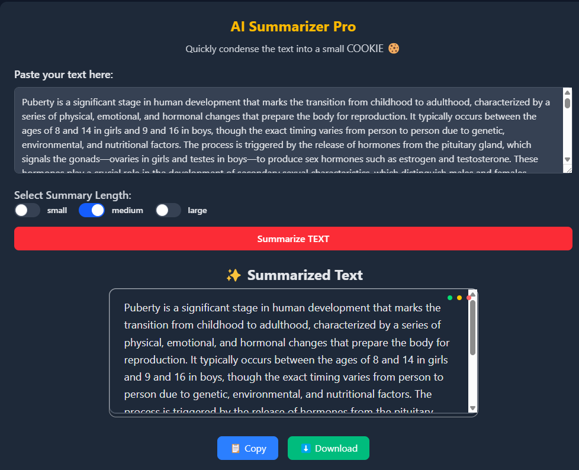
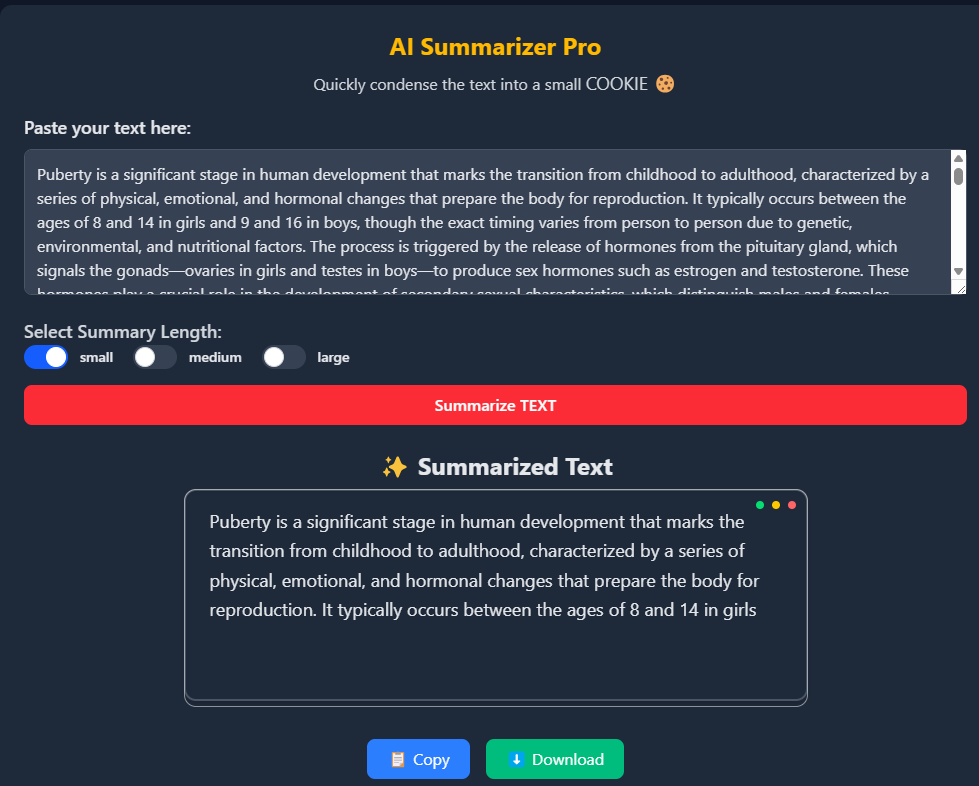

# 🚀 AI Summarizer Pro: Next-Gen Text Condensation

<div align="center">
  
  
  [](https://reactjs.org/)
  [](https://www.djangoproject.com/)
  [](https://huggingface.co/)
  [](https://opensource.org/licenses/MIT)

</div>

## 🌟 Live Demo
**Experience it now(only frontend):** [https://aitextsummarizer-navy.vercel.app/](https://aitextsummarizer-navy.vercel.app/)  


---

## 🎮 Interactive Demo Showcase

| Real-time Summarization | Multi-length Support | Dark Mode |
|-------------------------|----------------------|-----------|
|  |||

---

## 🛠️ Tech Stack Symphony

<div align="center">
  
| **Layer**       | **Technologies**                                                                 |
|-----------------|----------------------------------------------------------------------------------|
| **Frontend**    | React 19.2, Tailwind CSS, React Icons, Axios, react-spinners                        |
| **Backend**     | Django 5.2, Django REST Framework, PostgreSQL, JWT Authentication                |
| **AI Engine**   | Hugging Face Transformers (allenai/led-base-16384), ONNX Runtime, PyTorch  
</div>
---

## 🚀 Getting Started

### Prerequisites
```bash
# Frontend
Node.js >= 18.x
npm >= 9.x

# Backend
Python 3.10+
PostgreSQL 14+
